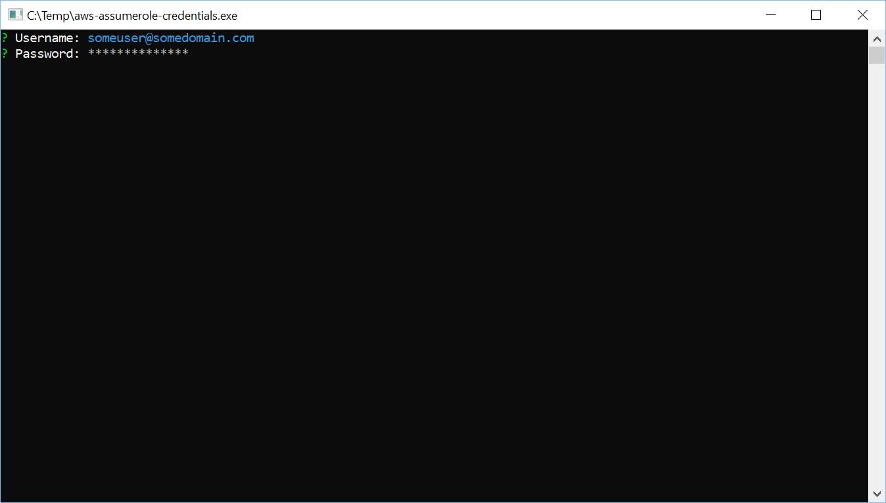
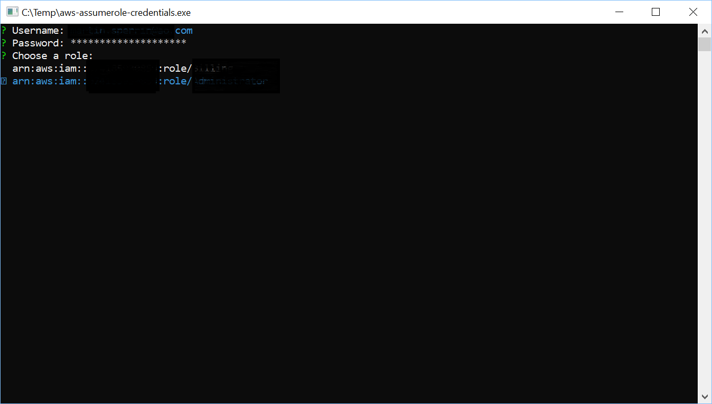
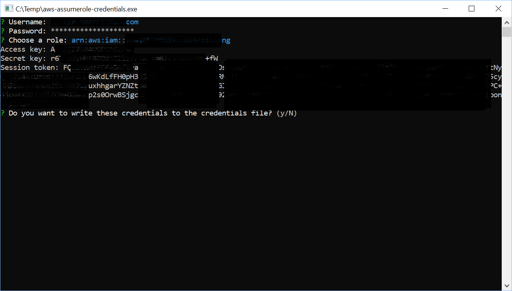
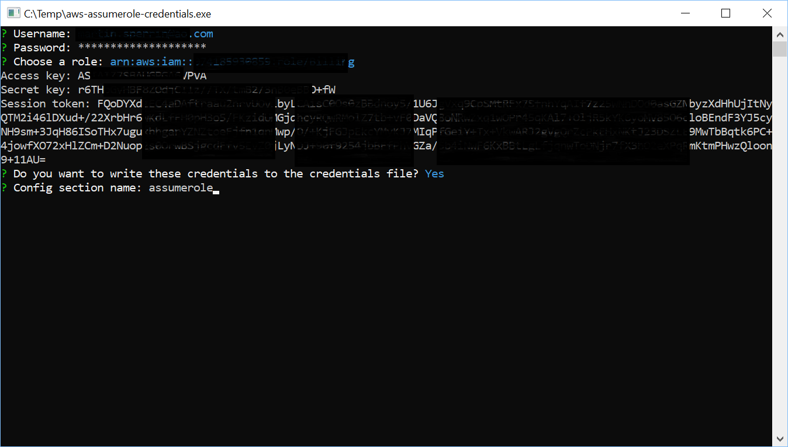
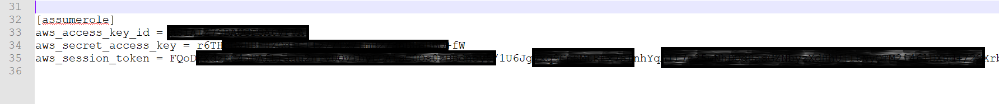

# aws-assumerole-credentials

## Description

A tool which gets roles from ADFS for which to assume role in AWS - and returns a set of temporary credentials. Optionally allows writing to the AWS credentials file to persist them.

## Quickstart

### Build

``` sh
go build
```

### Run

``` sh
.\assume-role-credentials
```

#### Usage

Once the app is running you will be presented with a prompt for your AD credentials, these can be entered in either <domain>\\<samaccountname> or UPN format, assuming you have this setup in your directory (i.e. email address). The password field is masked with asterisks.



Once the credentials have been entered you will be presented with a selection list of the roles that you can assume. Use the arrow keys and press enter to select a role.



This will return the access key, secret key and session token for the role you have selected to assume. You will be asked if you want to write these to your AWS credential file (the .aws/credentials file within your user home folder). If you intend to use these credentials elsewhere you will need to copy them to the clipboard, selecting no will exit the application.



If you select yes to the prompt you will be asked which profile you wish to write the credentials to. If the profile does not already exist it will be created. If it does exist the existing credentials will be overwritten.



You will be able to open your credential file and see the changes that have been made. Note that these credentials will only be valid for one hour, after which you will have to follow the process again to obtain new credentials.

